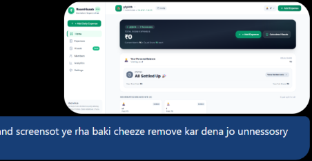

<div align="center">

# 🏠 RoomHisaab (रूम हिसाब)
**Smart, Simple & Stress-Free Shared Expense Manager for Roommates**

[](https://7f2ba9065061a1.lhr.life)
[](https://github.com/Sagar92115/roomhisab)
[](https://opensource.org/licenses/MIT)

<br/>

[](https://react.dev/)
[](https://nodejs.org/)
[](https://vitejs.dev/)
[](https://tailwindcss.com/)
[](https://sqlite.org/)

<p align="center">
  <b>🌐 Live App:</b> <a href="https://7f2ba9065061a1.lhr.life">https://7f2ba9065061a1.lhr.life</a>
</p>

</div>

---

## 📸 App Preview

<div align="center">
  
</div>

---

## 📌 Overview

Living with roommates or bachelors often leads to messy expense tracking across dairy, groceries, electricity, and LPG. Maintaining physical diaries or WhatsApp chats creates confusion and awkward settlement discussions.

**RoomHisaab** solves this with an automated equal-split rule and an optimal settlement algorithm that directly answers:
1. *"How much is my share for this period and whom do I need to pay?"*
2. *"How can I pay them immediately via 1-click UPI or QR code?"*

---

## ✨ Features

- ⚖️ **Strict Equal Split**: All expenses are divided equally among active roommates using integer paise (`amount * 100`) to eliminate floating-point rounding errors.
- 🧮 **Optimal Settlement Engine**: Greedy 2-pointer algorithm resolves all debts and credits in the minimum number of payments.
- 💳 **1-Click UPI & QR Payments**: Deep links (`upi://pay`) trigger installed UPI apps (GPay, PhonePe, Paytm, BHIM) with pre-filled amounts, alongside receiver QR code popups.
- 🔒 **Privacy & Room Isolation**: Clean welcome screen for new visitors with room creation and 8-character invite code access—no stranger's hisaab is exposed.
- 💬 **WhatsApp Summary**: One-click formatted summary ready to share in your roommate WhatsApp group.
- 🧊 **Month Lock / Freeze**: Lock settled months to prevent accidental modifications.
- 📱 **Responsive & Mobile-First**: Optimized for both mobile and desktop with bottom navigation and PWA support.

---

## 📊 How Hisaab Calculation Works

Example with **4 Roommates**: Sagar, Rahul, Amit, and Rohit.
- **Total Expenses:** ₹12,000
- **Equal Share:** ₹3,000 each

| Roommate | Paid | Fair Share | Balance | Status | Settlement Action |
| :--- | :---: | :---: | :---: | :---: | :--- |
| **Sagar** | ₹5,000 | ₹3,000 | **+₹2,000** | 🟢 Creditor | Receives ₹2,000 |
| **Amit** | ₹3,000 | ₹3,000 | **₹0** | ⚪ Settled | All settled |
| **Rahul** | ₹2,000 | ₹3,000 | **-₹1,000** | 🔴 Debtor | **Rahul ➔ Sagar: ₹1,000** |
| **Rohit** | ₹2,000 | ₹3,000 | **-₹1,000** | 🔴 Debtor | **Rohit ➔ Sagar: ₹1,000** |

$$\text{Total Paid by Debtors (₹2,000)} = \text{Total Received by Creditors (₹2,000)}$$

---

## 🛠️ Tech Stack

| Layer | Technology |
| :--- | :--- |
| **Frontend** | React 18, Vite, Tailwind CSS, Lucide Icons, Canvas Confetti |
| **Backend** | Node.js, Express |
| **Database** | Built-in SQLite (`node:sqlite`) with WAL mode |
| **Payments** | NPCI UPI Deep Linking, QR Code generation |

---

## 🚀 Quick Start (Local Setup)

### Prerequisites
- [Node.js](https://nodejs.org/) (v18 or higher)

### Run Locally

#### Option A: 1-Click Launcher (Windows)
Double-click **`start.bat`**. It initializes the database, starts the server, and opens [http://localhost:5000](http://localhost:5000).

#### Option B: Terminal
```bash
# 1. Clone repository
git clone https://github.com/Sagar92115/roomhisab.git
cd roomhisab

# 2. Install dependencies
npm install

# 3. Start server
npm start
```
Open [http://localhost:5000](http://localhost:5000) in your browser.

---

## 🌐 Deployment (24/7 Cloud Hosting)

To deploy the app permanently on [Render](https://render.com) for free:

1. Sign in to **Render.com** with your GitHub account.
2. Click **New +** ➔ **Web Service**.
3. Connect repository: `Sagar92115/roomhisab`.
4. Configure settings:
   - **Build Command**: `npm install && npm run build`
   - **Start Command**: `npm start`
   - **Instance**: Free
5. Click **Deploy Web Service** to receive your permanent HTTPS URL.

---

## 📂 Repository Structure

```text
roomhisab/
├── screenshots/
│   └── dashboard.png        # UI Dashboard preview for README
├── dist/                    # Bundled frontend (production)
├── src/                     # React 18 application source code
├── data/                    # SQLite database storage
├── uploads/                 # Roommate UPI QR images
├── db.js                    # SQLite database models & WAL mode
├── hisaabEngine.js          # Core equal-split & settlement engine
├── routes.js                # REST API routes
├── index.js                 # Express server entry point
├── start.bat                # 1-click Windows local launcher
├── start-live.bat           # 1-click public internet tunnel
└── package.json             # Dependencies and scripts
```

---

## 👤 Author

- **Sagar Patel** – [@Sagar92115](https://github.com/Sagar92115)
- Repository: [https://github.com/Sagar92115/roomhisab](https://github.com/Sagar92115/roomhisab)
- Live Demo: [https://7f2ba9065061a1.lhr.life](https://7f2ba9065061a1.lhr.life)

---
<div align="center">
  <b>⭐ Star this repo on GitHub if you found it useful! ⭐</b>
</div>
